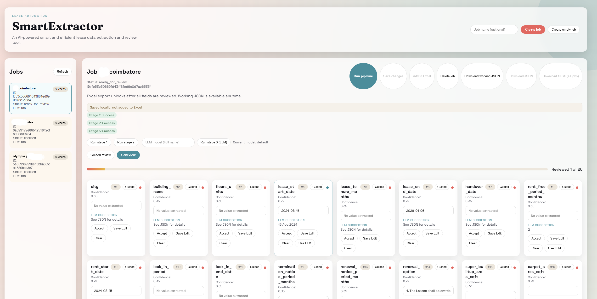

# Lease extractor by Yuvraj Verma

Local-only application that productizes the existing lease extraction pipeline. It runs the original scripts, stores every job on disk, and enforces a full human review before any export.



## What this app does
- Runs the existing extraction pipeline without changing its outputs.
- Forces every schema field through a required review step.
- Stores jobs locally with a full audit log.
- Exports a single shared Excel file where each job is one row (re-exports update that row).

## Features
- End-to-end pipeline orchestration (Stages 1-3)
- Ollama LLM fallback (best-effort, offline)
- Mandatory human review for all schema fields
- Guided and Grid review modes with field numbers and jump-to-field
- Evidence panel driven by anchors, ranked snippets, and LLM quotes
- Save changes (local) and Add to Excel (shared workbook)
- Job naming, job deletion, and download of JSON/XLSX
- Full audit log in `audit_log.jsonl`

## Project structure
```
app/
  backend/        FastAPI server
  core/           Orchestration + job model
  frontend/       React (Vite) UI
  jobs/           Per-job runtime folders (gitignored)
  export/         Shared Excel export (gitignored)
assets/           Screenshots and assets
extract/          Existing extraction pipeline scripts
```

## Job model (per job)
Each job lives at `app/jobs/<job_id>/` and includes:
```
input/lease.pdf
stage1/
stage2/
stage3/
final/
export/
job_meta.json
working_state.json
audit_log.jsonl
```

## Pipeline stages
- Stage 1: OCR and PDF pre-processing (existing pipeline)
- Stage 2: Anchors + parsing + validation + review queue (existing pipeline)
- Stage 3: LLM fallback (Ollama) for low-confidence fields

LLM is always attempted after Stage 2. If Ollama is unavailable, the app records `llm_status="unavailable"` and continues.

## Review rules (non-negotiable)
- Every schema field must be reviewed.
- The backend blocks export unless all fields are reviewed.
- Each action is written to `audit_log.jsonl`.

## Save vs. Export
- **Save changes**: persists the current edits to `working_state.json`.
- **Add to Excel**: writes or updates the job's row in a single shared file.
  - File: `app/export/lease_jobs.xlsx`
  - Each job ID maps to one row.
  - Re-adding updates the same row (no duplicates).

The UI shows status:
- Unsaved changes
- Saved locally, not added to Excel
- Excel up to date

## Backend setup (Windows / PowerShell)
From repo root:
```powershell
python -m venv .venv
.\\.venv\\Scripts\\activate
pip install -r requirements.txt
pip install -r app\\backend\\requirements.txt
python -m uvicorn app.backend.main:app --reload --port 8000
```

If PowerShell blocks activation:
```powershell
Set-ExecutionPolicy -Scope CurrentUser RemoteSigned
```

Or skip activation and run directly:
```powershell
.\\.venv\\Scripts\\python -m pip install -r requirements.txt
.\\.venv\\Scripts\\python -m pip install -r app\\backend\\requirements.txt
.\\.venv\\Scripts\\python -m uvicorn app.backend.main:app --reload --port 8000
```

## Frontend setup
In a separate terminal:
```powershell
cd app\\frontend
npm install
npm run dev
```

Open `http://localhost:5173`.

## Using the app
1. Create a job (upload a PDF or create an empty job).
2. Run the pipeline or run stages independently.
3. Review every field in Guided or Grid view.
4. Save changes as needed.
5. Add to Excel when review is complete.
6. Download JSON or the shared Excel file.

## LLM model override
- UI: set a full model name and run Stage 3.
- Env: `OLLAMA_MODEL` overrides the default for `extract/llm_fallback.py`.

## API endpoints
- `POST /jobs` (upload or create empty)
- `GET /jobs`
- `POST /jobs/{id}/run`
- `POST /jobs/{id}/run_stage/{stage}`
- `GET /jobs/{id}/state`
- `POST /jobs/{id}/field_action`
- `POST /jobs/{id}/save`
- `POST /jobs/{id}/export_excel`
- `POST /jobs/{id}/finalize` (legacy alias for export)
- `GET /jobs/{id}/download/final_json`
- `GET /jobs/{id}/download/working_json`
- `GET /jobs/{id}/download/xlsx`
- `DELETE /jobs/{id}`

## Data safety and GitHub
Sensitive lease data is gitignored. See `.gitignore` for:
- `app/jobs/`
- `app/export/`
- `data/input_pdfs/`
- `data/ocr_text/`
- `data/outputs/`
- `*.xlsx` / `*.xls`

## Notes
- The pipeline outputs are copied into the job's stage folders unchanged.
- If Ollama or the model is unavailable, the UI shows an "LLM unavailable" banner.
- To point the frontend at a different backend URL, set `VITE_API_URL`.
